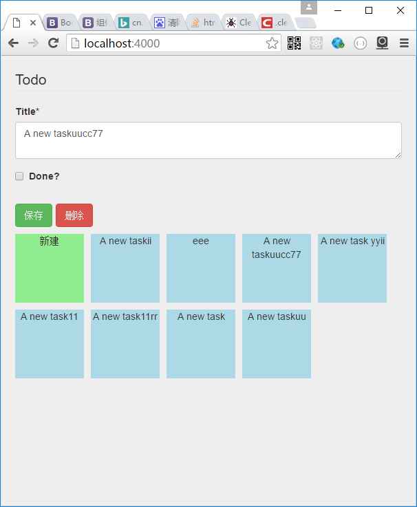

## RestFormEditor

---

React Form Editor for CRUD service

You have a CRUD service. I give you an editor UI.

build form by react-jsonschema-form

```js
import RestFormEditor from 'react-rest-form-editor';
const schema = {
  title: "Todo",
  type: "object",
  required: ["title"],
  properties: {
    title: {type: "string", title: "Title", default: "A new task"},
    done: {type: "boolean", title: "Done?", default: false}
  }
};

const uiSchema = {
    title: {
      "ui:widget": "textarea"
    }
}


const ThumbView=(props)=><div>{props.data?props.data.title:"new"}</div>

class PageDemo extends React.Component {

    render() {
        return (
            <div className="page-demo">
                 <RestFormEditor schema={schema}
                    uiSchema={uiSchema}
                    url="/api/post"
                    keyField="_id"
                    thumbView={ThumbView}/>
            </div>
        );
    }
}


ReactDOM.render(<PageDemo/>, document.getElementById('App'));
```
